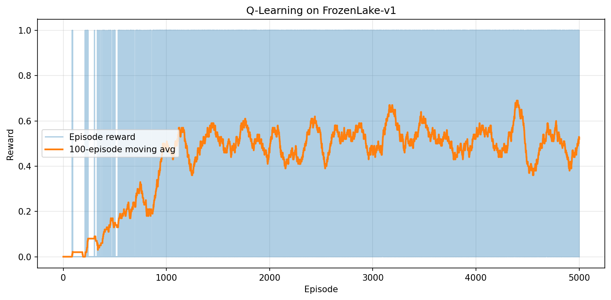
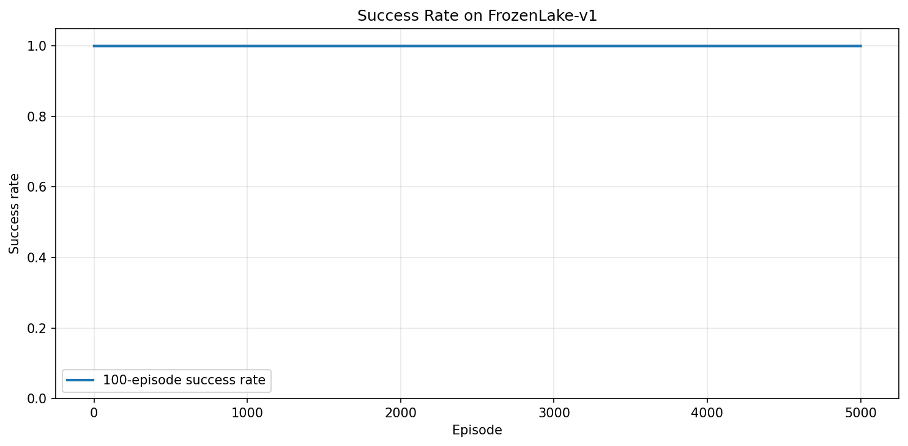

# Learning Agents Playground

**Author:** Huynh Mai Linh Nguyen · **[View live dashboard](https://learning-agents-playground.streamlit.app/)**

A hands-on reinforcement learning playground for training, evaluating, and visualizing classic and deep RL agents on Gymnasium environments. Built as an educational prototype for undergraduate research and portfolio work — focused on clarity and reproducibility, not state-of-the-art benchmarks.

---

## Overview

Learning Agents Playground is a modular Python project that walks through two core RL paradigms:

| Paradigm | Algorithm | Environment | State type |
|----------|-----------|-------------|------------|
| Tabular | Q-Learning | FrozenLake-v1 | Discrete |
| Deep | DQN | CartPole-v1 | Continuous |

The codebase covers the full experiment loop: YAML-driven training, CSV logging, checkpoint saving, matplotlib plots, CLI evaluation, and a Streamlit dashboard for exploring saved runs.

---

## Motivation

Reinforcement learning tutorials often jump straight to library APIs without showing how the pieces fit together. This project was built to:

- **Implement algorithms from scratch** — tabular Q-learning and a minimal DQN with replay buffer and target network
- **Practice reproducible experimentation** — centralized seeding, config files, and structured output directories
- **Bridge theory and tooling** — connect Bellman updates and neural function approximation to working code you can run, plot, and inspect

It is a learning sandbox, not a production RL framework. The goal is to understand *how* agents learn, not to chase leaderboard scores.

---

## Features

- **Agents:** `RandomAgent` (baseline), `QLearningAgent` (tabular), `DQNAgent` (128→128 MLP)
- **Environments:** Gymnasium factory with seeding and `is_slippery` support for FrozenLake
- **Training:** Episode-level CSV logs, automatic plot generation, agent checkpoints
- **Evaluation:** Success rate and reward summaries via CLI
- **Dashboard:** Streamlit app with Environment and Agent selectors, moving-average charts, and saved asset viewer
- **Testing:** Lightweight smoke tests (`pytest`) for imports, agent APIs, and short training loops

---

## Project Structure

```
learning-agents-playground/
├── README.md
├── requirements.txt
├── pyproject.toml
├── app.py                          # Streamlit dashboard (visualization only)
├── configs/
│   ├── frozenlake_q_learning.yaml
│   └── cartpole_dqn.yaml
├── scripts/
│   ├── train_q_learning.py         # CLI: tabular Q-learning
│   ├── train_dqn.py                # CLI: DQN training
│   ├── evaluate_agent.py           # CLI: evaluate checkpoints
│   └── plot_results.py             # CLI: re-plot from CSV
├── src/
│   ├── agents/
│   │   ├── random_agent.py
│   │   ├── q_learning.py
│   │   └── dqn.py
│   ├── envs/
│   │   └── make_env.py
│   ├── training/
│   │   ├── train_q_learning.py
│   │   └── train_dqn.py
│   ├── evaluation/
│   │   ├── evaluate.py
│   │   └── metrics.py
│   └── utils/
│       ├── seeding.py
│       ├── plotting.py
│       └── replay_buffer.py
├── results/                        # Training outputs (created on first run)
│   ├── frozenlake_qlearning/
│   └── cartpole_dqn/
└── tests/
    └── test_smoke.py
```

---

## Installation

**Requirements:** Python 3.10+

```bash
git clone https://github.com/<your-username>/learning-agents-playground.git
cd learning-agents-playground

python -m venv .venv
source .venv/bin/activate          # Windows: .venv\Scripts\activate

pip install -r requirements.txt
```

### PyTorch note

`requirements.txt` installs `torch>=2.0.0` from PyPI. On some platforms (especially macOS or CUDA-specific setups), you may prefer the official install command from [pytorch.org](https://pytorch.org/get-started/locally/) before installing other dependencies:

```bash
# Example: CPU-only PyTorch (adjust for your platform)
pip install torch --index-url https://download.pytorch.org/whl/cpu
pip install -r requirements.txt
```

Smoke tests skip DQN-related cases if PyTorch is unavailable. Set `LAP_SKIP_TORCH_TESTS=1` to force-skip torch tests even when installed.

---

## Quick Start

All training runs via CLI scripts. The Streamlit app only visualizes saved results.

### Train Q-Learning on FrozenLake

```bash
python scripts/train_q_learning.py --config configs/frozenlake_q_learning.yaml --verbose
```

Default config (`configs/frozenlake_q_learning.yaml`): 5,000 episodes on slippery 4×4 FrozenLake, seed 42.

**Outputs** → `results/frozenlake_qlearning/`:

| File | Description |
|------|-------------|
| `training_log.csv` | Per-episode reward, success, epsilon, steps |
| `rewards.png` | Reward curve with moving average |
| `success_rate.png` | Rolling success rate |
| `agent.pkl` | Saved Q-table checkpoint |

Override options:

```bash
python scripts/train_q_learning.py --episodes 1000 --seed 0 --verbose
python scripts/train_q_learning.py --output-dir results --verbose
```

### Train DQN on CartPole

```bash
python scripts/train_dqn.py --config configs/cartpole_dqn.yaml --verbose
```

Default config (`configs/cartpole_dqn.yaml`): 500 episodes on CartPole-v1, 128-hidden MLP, replay buffer, target network sync every 10 episodes.

**Outputs** → `results/cartpole_dqn/`:

| File | Description |
|------|-------------|
| `training_log.csv` | Per-episode reward, success, epsilon, steps, avg_loss |
| `rewards.png` | Reward curve with moving average |
| `losses.png` | TD-loss curve |
| `agent.pt` | Saved PyTorch checkpoint |

Override options:

```bash
python scripts/train_dqn.py --episodes 200 --seed 0 --verbose
```

### Evaluate Agents

Load a checkpoint and run evaluation episodes (default: 100, seed 42):

```bash
# Q-learning on FrozenLake
python scripts/evaluate_agent.py \
  --agent-type qlearning \
  --checkpoint results/frozenlake_qlearning/agent.pkl \
  --env-id FrozenLake-v1 \
  --episodes 100

# DQN on CartPole
python scripts/evaluate_agent.py \
  --agent-type dqn \
  --checkpoint results/cartpole_dqn/agent.pt \
  --env-id CartPole-v1 \
  --episodes 100
```

Optional: save summary JSON with `--output results/eval_summary.json`.

For FrozenLake, control slipperiness with `--is-slippery` / `--no-is-slippery` (default: slippery).

### Re-plot from CSV

Regenerate plots from an existing training log:

```bash
python scripts/plot_results.py --csv results/frozenlake_qlearning/training_log.csv
```

Plots are saved alongside the CSV as `replotted_rewards.png` and (if applicable) `replotted_success_rate.png`.

### Streamlit Dashboard

**[View live dashboard](https://learning-agents-playground.streamlit.app/)** — explore pre-trained results online. To run locally:

```bash
streamlit run app.py
```

The dashboard provides:

- **Sidebar selectors** — Environment (`FrozenLake-v1`, `CartPole-v1`) and Agent (`Random`, `Q-learning`, `DQN`)
- **Metrics** — Episode count, mean/max reward, success rate
- **Tabs** — Rewards chart, success rate, raw CSV table, saved PNG/checkpoint assets
- **Auto-discovery** — Finds the latest matching run under `results/`, or falls back to default run names (`frozenlake_qlearning`, `cartpole_dqn`)

> **Note:** Training is **not** performed in the app. Run the CLI scripts first, then launch the dashboard to explore results.

---

## Configuration

Key hyperparameters are defined in YAML. All configs support `seed`, `run_name`, and `output_dir`.

### FrozenLake Q-Learning

| Key | Default | Description |
|-----|---------|-------------|
| `env_id` | `FrozenLake-v1` | Gymnasium environment |
| `is_slippery` | `true` | Stochastic vs deterministic transitions |
| `episodes` | `5000` | Training episodes |
| `learning_rate` | `0.1` | Q-learning step size (α) |
| `discount_factor` | `0.99` | Bellman discount (γ) |
| `epsilon` / `epsilon_decay` | `1.0` / `0.995` | Epsilon-greedy exploration schedule |

### CartPole DQN

| Key | Default | Description |
|-----|---------|-------------|
| `env_id` | `CartPole-v1` | Gymnasium environment |
| `episodes` | `500` | Training episodes |
| `hidden_dim` | `128` | MLP hidden size (128→128) |
| `batch_size` | `64` | Replay mini-batch size |
| `buffer_capacity` | `100000` | Replay buffer capacity |
| `warmup_steps` | `1000` | Steps before gradient updates |
| `target_update_freq` | `10` | Target network sync frequency |
| `success_threshold` | `195.0` | Reward threshold for "solved" episodes |

---

## Example Results

After training, each run directory under `results/<run_name>/` contains logs, plots, and checkpoints. Example paths:

**FrozenLake Q-Learning** (`results/frozenlake_qlearning/`):




**CartPole DQN** (`results/cartpole_dqn/`):


> Plots are generated automatically during training. If images are missing locally, run the training commands above first.

Typical outcomes on default configs (your results may vary with seed and hardware):

- **FrozenLake (slippery):** Success rate improves gradually over thousands of episodes; learning is noisy due to stochastic transitions.
- **CartPole:** DQN typically reaches near-threshold rewards (~195+) within a few hundred episodes, though convergence is not guaranteed on every run.

---

## What I Learned

Building this project reinforced several RL concepts in practice:

- **Exploration vs exploitation** — epsilon decay schedules matter; too-fast decay can trap tabular agents in local optima on slippery FrozenLake
- **Off-policy learning** — Q-learning bootstraps from the max Q-value of the next state; DQN approximates this with a neural network and replay buffer
- **Stabilizing deep RL** — experience replay, target networks, and warmup steps reduce divergence; without them, CartPole training is noticeably less stable
- **Reproducibility habits** — seeding Python/NumPy/env RNGs and logging every episode to CSV makes debugging and comparison much easier than printing to stdout
- **Separation of concerns** — keeping training (CLI), evaluation, and visualization (Streamlit) in distinct entry points keeps the codebase easier to reason about

---

## Limitations

This is an intentionally minimal prototype. Be aware of the following:

- **Not SOTA** — no Double DQN, Dueling architectures, prioritized replay, or hyperparameter tuning pipelines
- **Small environment set** — only FrozenLake and CartPole; no Atari, continuous control, or multi-agent setups
- **Single-run workflow** — no experiment tracking (Weights & Biases, MLflow), hyperparameter sweeps, or parallel training
- **Basic evaluation** — no statistical significance testing or confidence intervals across multiple seeds
- **Dashboard is read-only** — no live training or hyperparameter editing in Streamlit
- **Slippery FrozenLake is hard** — tabular Q-learning may need many episodes and still show high variance

These trade-offs are by design for a learning-focused codebase.

---

## Roadmap

Possible next steps if extending the project:

- [ ] Add Double DQN and compare against vanilla DQN on CartPole
- [ ] Multi-seed training with aggregated mean ± std plots
- [ ] Policy gradient baseline (REINFORCE) on CartPole
- [ ] Additional environments (MountainCar, Acrobot)
- [ ] Experiment logging integration (CSV → W&B or TensorBoard)
- [ ] Random-agent evaluation baseline with logged metrics

---

## Testing

```bash
pytest tests/test_smoke.py -v
```

Smoke tests verify imports, agent save/load, metrics helpers, short Q-learning runs, and (when PyTorch is available) DQN forward passes and mini training loops. They use only a handful of episodes — not full training.

---

## License

MIT License — see [LICENSE](LICENSE) file. (If no LICENSE file is present in the repository, this project is intended to be released under the MIT License.)

